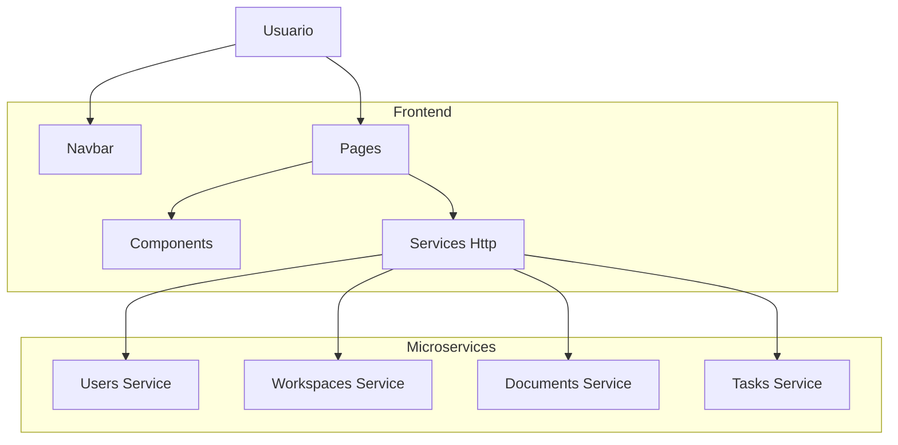

# Insightflow - Frontend

Frontend de la plataforma **Insightflow**, que permite organizar notas, espacios de trabajo y tareas. Forma parte de una arquitectura de **microservicios**, consumiendo los servicios de Users, Workspaces, Documents y Tasks.

Este proyecto se centra en mostrar y gestionar la información de los usuarios y espacios de trabajo a través de la UI, comunicándose con los microservicios vía HTTP.

---

## Arquitectura y Patrón de Diseño

### Arquitectura: Microservicios

El frontend implementa:

- Arquitectura de capas (Layered Architecture)
- Comunicación **síncrona** mediante **HTTP**
- Gestión de rutas y páginas mediante **NextJS**



### Patrones de Diseño Implementados

1. **Component-Based Architecture:** Separación de UI en componentes reutilizables
2. **Service Layer:** Abstracción de llamadas HTTP a los microservicios
3. **Routing con NextJS:** Gestión de rutas y navegación.

## Tecnologías Utilizadas

- **Framework:** NextJS 16+
- **Contenedores:** Docker
- **Comunicación con microservicios:** HTTP
- **Versionado:** Git + Conventional Commits
- **CI/CD:** Github Actions

## Estructura del Proyecto

- **app/:** Páginas de la aplicación NextJS
- **app/api:** Clases para llamadas a los microservicios
- **components/:** Componentes reutilizables de UI
- **libs/:** Utilidades de TailwindCSS
- **models/:** Modelos TypeScript de los servicios
- **utils/:** Funciones auxiliares

## Instalación y Configuración Local

### Requisitos previos

- **NodeJS 22 o superior**: [Download](https://nodejs.org/en)
- **Visual Studio Code**: [Download](https://code.visualstudio.com/)

### 1. Clonar el Repositorio

```bash
git clone https://github.com/AlbertoLyons/insightflow-frontend.git

cd insightflow-frontend
```

### 2. Establecer las variables de entorno

Crear un archivo llamado **.env**, y pegar el siguiente contenido:

```bash
NEXT_PUBLIC_USERS_URL=https://users-service-x9p9.onrender.com/
NEXT_PUBLIC_WORKSPACES_URL=https://workspace-service-app.onrender.com/api/
NEXT_PUBLIC_DOCUMENTS_URL=your_documents_service_url_here/api/
NEXT_PUBLIC_TASKS_URL=https://task-service-api.onrender.com
```

### 3. Instalar Dependencias

```bash
npm install
```

### 4. Ejecutar el Proyecto

```bash
npm run dev
```

El servicio estará disponible en: http://localhost:3000

## Servicio desplegado

**Frontend**: https://insightflow-frontend-nine.vercel.app/

## Servicio workspaces-service

El módulo de espacios de trabajo está definido en el siguiente link:

```bash
https://workspace-service-app.onrender.com/api/
```

Las consultas disponibles en el módulo son las siguientes (Se adjunta una colección de postman en el repositorio para un mayor entendimiento.):
[Colección de postman del módulo routes](./postman-collections/Workspace.postman_collection.json)

### Crear espacio de trabajo (Metodo POST)

```bash
https://workspace-service-app.onrender.com/api/workspaces
```

Este metodo permite crear un nuevo espacio de trabajo dando los siguientes parametros en el body como un form data:

- Name: Nombre del espacio del trabajo
- Description: Descripción del espacio de trabajo
- Topic: Temática
- Image: Ícono a asignar para el espacio. Debe de ser un archivo .png o .jpg
- OwnerId: ID del usuario que creará el espacio
- OwnerName: Nombre del usuario que creara el espacio

### Obtener espacios de trabajo por usuario (Metodo GET)

```bash
https://workspace-service-app.onrender.com/api/workspaces?userId=id
```

Este metodo permite obtener todos los espacios de trabajo en el que un usuario esté asignado sea propietario o editor

### Obtener espacio de trabajo por id (Metodo GET)

```bash
https://workspace-service-app.onrender.com/api/workspaces/{id}
```

Este metodo permite obtener una un espacio de trabajo por su id

### Actualizar espacio de trabajo (Metodo PATCH)

```bash
https://workspace-service-app.onrender.com/api/workspaces/{id}
```

Este metodo permite editar un espacio de trabajo dando como párametro en la ruta su id. Los párametros que deben de ir en el body como form data son los siguientes:

- Name: Nombre a modificar del espacio de trabajo
- Image: Ícono a asignar para el espacio. Debe de ser un archivo .png o .jpg (Parámetro opcional)

Esta ruta está protegida por autenticación, en la que solo el propietario del espacio de trabajo puede usar.

### Eliminar ruta (Metodo DELETE)

```bash
https://workspace-service-app.onrender.com/api/workspaces/{id}
```

Este metodo permite la eliminación de un espacio de trabajo mediante el uso de soft delete. Se debe de dar la id del espacio de trabajo como párametro en la ruta.

Esta ruta está protegida por autenticación, en la que solo el propietario del espacio de trabajo puede usar.

## Servicio Task-Service

El **Task-Service** es el microservicio encargado de la gestión de tareas dentro de la plataforma **InsightFlow**. 

```bash
https://task-service-api.onrender.com
```

Métodos Disponibles:

## Crear Tarea (POST) ##

Permite la creación de una nueva tarea asociada a un documento específico.

## Editar Tarea (PUT) ##

Permite la edicion de una tarea existente en el documento. En **Insightflow - Frontend** la edicion se puede llevar a cabo de las siguientes maneras:

- **Edicion de Atributos por Formulario:** Permite modificar los siguientes campos atraves de un formulario:
    - Titulo.
    - Descripción.
    - Reponsable.
    - Comentarios
    - Fecha de Finalización.

- **Edicion de Estado Drag and Drop:** Este tipo de edicion soporta:
    - Cambio de estado de la tarea.
    - Envió a papelera (Implementado como Soft Delete)

## Visualizacion de Tareas por Documento (GET) ##

Permite visualizar las tareas asociadas a un documento. Las Tareas se agrupan e columnas segun su estado.
- Pendiente
- En Progeso
- Completado

## Visualizar Detalles ed una Tarea (GET) ##

Permite visualizar los detalles de una tarea, incluyendo:
- Descripción
- Comentarios

## Mover/recuperar de papelera (PATCH) ##

Implementado como Sof Delete, permite enviar tareas a la papelera mediante drag and drop, ademas de poder recuperar tareas eliminadas.


Para obtener más información sobre la implementación de  **servicio de Tareas** visita el repositorio [TaskService](https://github.com/InsightFlowDevelopmentTeam/insightflow-task-service.git)

## Servicio documents-service

Las consultas disponibles en el módulo son las siguientes 
### Crear documento (Metodo POST)

Este metodo permite crear un nuevo documento dando los siguientes parametros en el body como un form data:

- Title: Titulo de documento a crear.
- contentJson: Documento Json con informacion del documento.
- icon: Ícono a asignar para el documento. Debe de ser un archivo .png o .jpg
- OwnerId: ID del usuario que creará el documento

### Obtener docuemnto por id de espacio de trabajo (Metodo GET)

Este metodo permite obtener todos los documentos por medio de un id de espacios de trabajo.

### Obtener documento por id (Metodo GET)

Este metodo permite obtener un documento, ingresando su id en la ruta.

### Actualizar documento (Metodo PUT)

Este metodo permite editar un documento existente dando como párametro en la ruta su id. Los párametros que deben de ir en el body como form data son los siguientes:

- title: Titulo a modificar del espacio de trabajo
- icon: Ícono a asignar para el espacio. Debe de ser un archivo .png o .jpg (Parámetro opcional)
- contentJson: documento Json a modificar

Esta ruta está protegida por autenticación, en la que solo el propietario del espacio de trabajo puede usar.

### Eliminar documento (Metodo DELETE)

Este metodo permite la desactivación de un documento existente mediante el uso de soft delete. Se debe de dar la id del documento como párametro en la ruta.

Esta ruta está protegida por autenticación, en la que solo el propietario del espacio de trabajo puede usar.

